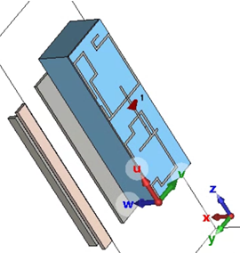

# MetaRF_antennas


## Preface

I will use this readme file to help you understand the scripts I wrote and 
modify\create your own model.
In this document I will address model 6 since this is the latest one I wrote and as 
such, It is the most up-to-date with the things I learnt along the way.

A general thought you should keep in mid is that when we generate the data there are 
several important issues we have to pay our attention to:
* __Model size__:

    The model should be general enough for our problem, but its boundaries 
  should be 
  kept in a reasonable size, or else the simulation will run on large models with long 
  simulation times for datapoints that are rarely used. Large models will introduce 
  two problems:
  * long simulation times for (maybe) irrelevant sub-space of the problem
  * an antenna which is very large compared to the wavelength will have many 
    resonances, which will make the training process longer and harder.
* __Antenna model__:  
    when deciding on the proper antenna model and its parametrization, we should 
  consider two opposing consideration:
    * Non-trivial designs:
    
        On the one hand, the design and its description should exceed the designer's 
      trivial solution. We can simply place a trivial dipole antenna but if we will 
      provide the model with more degrees of freedom it might surprise us with 
      non-trivial solutions.
    * Non-null antennas:

        On the second hand, if the design will have too many degrees of freedom (DOF), on 
      the random process of data generation we might have low yield of good performing 
      antennas.

    The way I chose to treat this trade-off is to add many DOF to the model and apply 
  some logic conditions on the data generation procedure.

## Preperations

* __file tree__:

    the file tree for any project should look something like that:
    ```
    |--PROJECT_NAME
  |  |--CST_FILE.cst
  |  |--output
  |     |--model_pictures
  |     |--models
  |     |--results
  |     |--S11_pictures
    ```
    All folder should start as empty 


##	CST-python interface

 There are two built-in libraries for python for automation of the data generation 
 process. One of them is dedicated for the modeling of the antenna and its environment 
     and the other is for processing the results of the simulation.
 Both have an extended documentation and the python script files I attached can be 
      used as an example for modifying models and extracting the desired results.

 A quick sidenote: I prefer to get the radiation pattern results from the 
      postprocessing of the simulation and simply copying it to my dedicated result 
      folder. I get the 1D results (i.e. S parameters\ impedance\ efficiencies) from 
      the result module of the python libraries. Both cases are highlighted in the 
 following sections.

## 1.	The model (environment)
 The current (NITS) project is compatible with parametric models. So the environment 
       has to be described as a set of parameters. This set of parameters should have 
       a corresponding dictionary that describe its limits as shown in the example 
 below (from ```cst_model6_on_beast```):

```
model_parameters = {
    'type':6,
    'plane':'yz-flipped',
    'LG_z':10,
    'LG_y': 50,
    'A_z':1
}

## --- define the model parameters limits for randomization:
model_parameters_limits = model_parameters.copy()

model_parameters_limits['LG_z'] = [10,80]
model_parameters_limits['LG_y'] = [10,30]
model_parameters_limits['A_z'] = [5, 20]
```

The parameters names should be the same as the ones in the CST project.

## 2. The antenna
The antenna should be described in a parametric description. It's not very important 
what the parameters are but it is more convenient if they are self-consistent.
I tend to create a list of the antenna parameters using the line:
``` ant_parameters_names = parametric_ant_utils.get_parameters_names()``` from ```
parameteric_ant_utils_model6```, for example.

An important function is the function ```check_ant_validity(ant_parameters,model_parameters)```
in ```parameteric_ant_utils_model6``` that takes the model and antenna parameters and 
checks if it is a valid antenna. you should make the parameters such that 
most antennas will be valid and keep this function as simple as possible. Without such 
function, the CST might get stuck mid-run which is not ideal. The main things you need 
to keep in mind when writing this function is cst modelling errors and feed conflicts. 
In earlier models  and for complete back-compatibility we remained with a very long 
validation function for the two first models. 

I hard-coded the antenna randomization parameters since the antenna model was 
(separately) fixed for any of the models we worked with while the model randomization was 
changed between runs.

For each model I also created a ```create_bricks_list```- style function for Avi's 
bootstrapping method.

## 3. The results

In short, S11 parameters are accessed with:
```
S_results = results.get_3d().get_result_item(r"1D Results\S-Parameters\S1,1")
S11 = np.array(S_results.get_ydata())
freq = np.array(S_results.get_xdata())
```
And radiation patterns are simply copied with:
```
# save the farfield
copy_tree(pattern_source_path, results_path + '\\' + str(run_ID))
```


## CST sidenotes:
Some important notes regrading the CST model:
* If you build your own CST project, make sure to export the farfields using the 
post-processing scheme in CST result template.
* If you want to use the graph network - you must also export the STP files for each run.
      I like to do so by using a VBA macro code that export the model. I do it for 
  every element separately (antenna and environment) and for each material (PEC/FR4/...).
I did it by using commands like:
```
for file_name in file_names:
    VBA_code = r'''Sub Main
    SelectTreeItem("Components'''+'\\'+file_name+r'''")
        Dim path As String
        Path = "./'''+file_name+'''_STEP.stp"
        With STEP
            .Reset
            .FileName(path)
            .WriteSelectedSolids
        End With
    End Sub'''
    project.schematic.execute_vba_code(VBA_code)
```
And then copying it using: 
```
for filename in os.listdir(STEP_source_path):
    if filename.endswith('.stp'):
        shutil.copy(STEP_source_path + '\\' + filename, target_STEP_folder)
```

## attached files description:

The models' name sometimes have wierd names for a complete and bug-free:
```
At Moshe's paper - model 1 (= model_3) = 'CST_Model_better_parametric.cst'

At Moshe's paper - model 2 (= model_5) = 'CST_Model_better_parametric_model5.cst'

At Moshe's paper - model 3 (= model_6) = 'CST_Model6.cst'
```
